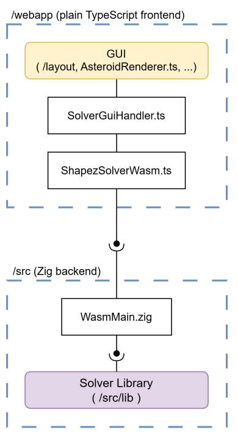

<p align="center">
    
</p>

# FOAMS - a Fast Offline Asteroid Miner Solver for Shapez 2

Runs entirely on your machine, from within your browser.  

## Links

- [Solver site](https://blazingtwist.github.io/Shapez2MinerSolver/)
- [Offline version download](https://github.com/BlazingTwist/Shapez2MinerSolver/releases/latest)

## Demo

[demo.webm](https://github.com/user-attachments/assets/1555ee8d-f351-4c38-abba-46c530f1aaa2)

## Brief algorithm description

The solver is split into 3 phases:
1. Walk the asteroid edge clockwise, trying to maximize the number of miners on the edge.
2. Clean up the edge-miner extenders to make filling the center easier.
3. Fill the center from top-left to bottom-right.

At the core of the algorithm is a heuristic on the quality of miner placements.  
This heuristic applies penalties for creating unsolvable layouts and tiles with many mismatching neighbors.

The performance is achieved by the algorithm being mostly greedy.  
Phase 1 greedily maximizes miners with a limited lookahead.  
Phase 3 greedily minimizes the heuristic, while allowing backtracking on the most recent decision only.  

## Project architecture



### `/webapp` (plain Typescript frontend)

- `ShapezSolverWasm.ts` handles bidirectional communication with the Zig backend
- `SolverGuiHandler.ts` processes events from the solver (such as new miner placements)
- `AsteroidRenderer.ts` implements the view-modes for the Preview Canvas
- `ColorGenerator.ts` controls how miners are colored for each solver phase
- `Settings.ts` solver and website settings
- `Strings.ts` all (most) translatable Strings used by the GUI
- `layout/*` HTML generators for the windows and sidebar

### `/src` (Zig backend)

- `/build.zig` defines artifacts that can be built/ran (Currently: Test, WASM)
- `WasmMain.zig` provides an API to the Solver for the frontend
- `TestsMain.zig` and `test/*` define santiy- and quality-tests for the Solver
- `lib/*` the actual solver algorithm

## Developer Commands

Zig: 0.13.0  
Node: 24.18.1  
TypeScript: 7.0.2  

### Test solver on sample asteroids

```shell
# typically
zig test -O ReleaseFast ./src/TestsMain.zig
# when things go wrong
zig test -O Debug ./src/TestsMain.zig
```

### Build solver WASM

```shell
zig build --release -Dmake-wasm=true
```

### Compile frontend

```shell
npm ci
cd ./webapp
npx tsc

# To test the solver, host a web-server on the project root.
# That is: /zig-out must be accessible on the web-server.
```

## Contributing

**Issues** and **pull requests** are welcome.

[**Kofi**](https://ko-fi.com/blazingtwist0016) - My work is free for everyone, so if you want to help me pay my bills (and can afford it),
you can support me directly here.

<br/>

If you want to get your hands dirty, here are some suggestions for pull requests which I'd be ecstatic about:
- Improved typography for the 'Links' or 'Help' sidebar Panels.
- An offline version for Linux
  - e.g. a distro-agnostic bash script that sets up a local webserver.
- Support for older Shapez2 blueprint versions (`SHAPEZ2-1`, `SHAPEZ2-2`, `SHAPEZ2-3`)
- Improved default settings / algorithms
  - If you pull-request algorithm changes, please run the test-suite and verify that your change is better on all sample asteroids.
- A revised algorithm for solver phase 1
  - The edge-walking approach breaks for thin or hourglass-shaped asteroids.  
    For example: consider   
    By applying the lookahead along the clockwise edge, the opposing edge is never considered.  
    So the algorithm makes a bad choice: 
  - A potential fix could be to sort edge-tiles by distance, instead of walking the perimeter.
  - Or even an entirely different algorithm.
- A terminal frontend.
  - You could extend `build.zig` (and add `src/TerminalMain.zig`) to build a terminal version of the solver.
